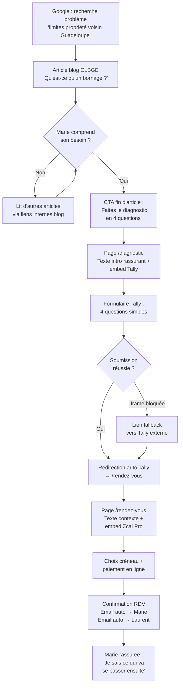
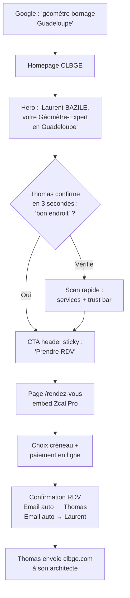
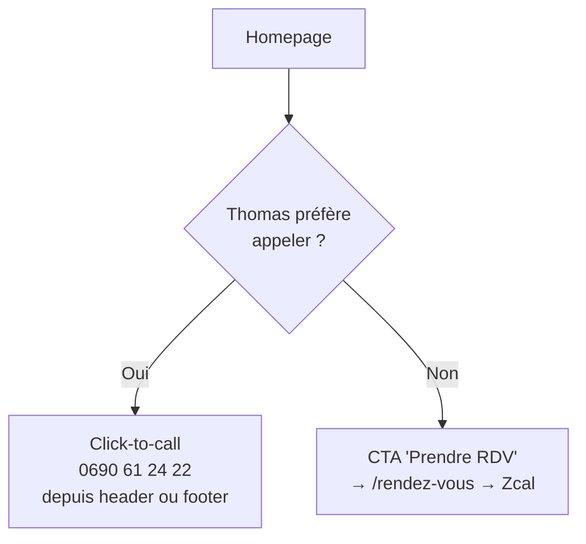
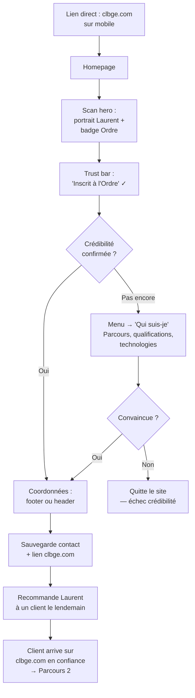
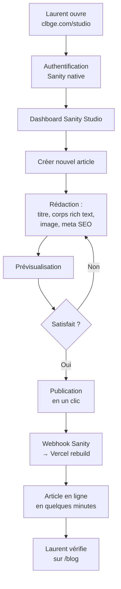

---
stepsCompleted:
  - 1
  - 2
  - 3
  - 4
  - 5
  - 6
  - 7
  - 8
  - 9
  - 10
  - 11
  - 12
  - 13
  - 14
status: complete
completedAt: '2026-03-19'
inputDocuments:
  - planning-artifacts/prd.md
  - planning-artifacts/architecture.md
  - planning-artifacts/design-specs.md
  - planning-artifacts/epics.md
  - planning-artifacts/implementation-readiness-report-2026-03-15.md
---

# UX Design Specification CLBGE

**Author:** Onizuka
**Date:** 2026-03-17

---

## Executive Summary

### Vision Projet

Le site CLBGE est le premier site professionnel de géomètre-expert en Guadeloupe à proposer une approche digitale moderne : pédagogie du métier, diagnostic interactif, prise de RDV avec paiement en ligne. Le positionnement "géomètre nouvelle génération" dans un marché dominé par des professionnels sans présence web crée une opportunité UX unique : même un design sobre et bien exécuté sera un différenciateur majeur.

Le défi UX central est de servir simultanément deux publics opposés : les non-initiés qui ont besoin d'être éduqués (comprendre le métier → diagnostiquer leur besoin → prendre RDV) et les professionnels/initiés qui veulent accéder directement aux coordonnées ou au RDV en quelques secondes.

### Utilisateurs Cibles

**Particulier non-initié (Marie)** — Ne sait pas qu'elle a besoin d'un géomètre. Arrive via le blog SEO ou une recherche Google. A besoin d'être rassurée et guidée. Parcours long : éducation → diagnostic → RDV. Appareil principal : mobile.

**Particulier informé (Thomas)** — Sait ce qu'il veut. Veut un géomètre fiable et un RDV rapide. Parcours court : homepage → RDV direct. Appareil : mobile ou desktop.

**Professionnel (Maître Célimène, notaire)** — Cherche un prestataire fiable à recommander. Évalue la crédibilité via le profil, les qualifications et les technologies. Besoin : coordonnées accessibles immédiatement. Appareil : mobile (souvent en déplacement).

**Administration (DST)** — Vérifie la crédibilité d'un prestataire pour un marché public. Consulte le profil, les qualifications, les services. Besoin : image professionnelle et structurée. Appareil : desktop.

**Administrateur (Laurent)** — Gère le contenu du site en autonomie. Publie des articles blog sans compétence technique. Besoin : back-office intuitif, publication en quelques minutes.

### Défis UX Clés

1. **Double tunnel éducation/conversion** — Offrir deux chemins fluides : le parcours long (éducation → diagnostic → RDV) pour les non-initiés et le parcours court (CTA direct → RDV) pour les initiés, sans que l'un ne crée de friction pour l'autre.

2. **Crédibilité instantanée sur mobile** — Les professionnels et administrations vérifient le site rapidement. Le profil, les qualifications et les coordonnées doivent être accessibles en quelques secondes, avec une hiérarchie visuelle claire.

3. **Intégrations tierces transparentes** — Les embeds Tally (diagnostic, contact) et Zcal Pro (RDV + paiement) doivent s'intégrer naturellement dans le parcours utilisateur, avec des transitions fluides et des fallbacks en cas de blocage iframe.

### Opportunités UX

1. **Référence digitale dans un marché vide** — Aucun concurrent n'a de site professionnel en Guadeloupe. Un design sobre, moderne et bien exécuté crée un avantage concurrentiel durable et positionne Laurent comme le géomètre de référence.

2. **Diagnostic interactif comme outil de confiance** — Le formulaire Tally peut être présenté comme un outil pédagogique ("Répondez à 4 questions pour comprendre votre besoin") qui crée de la valeur perçue et réduit l'anxiété avant le premier contact.

3. **Parcours mission en 5 étapes** — Opportunité visuelle forte de rassurer les prospects avec un parcours prévisible et transparent, renforçant le positionnement de modernité et de professionnalisme.

## Core User Experience

### Defining Experience

L'expérience coeur de CLBGE repose sur deux parcours distincts mais complémentaires :

**Parcours principal (volume) — Le professionnel qui arrive par recommandation :**
Accès direct aux coordonnées et au RDV. Pas besoin de convaincre, juste de confirmer la crédibilité et de faciliter le passage à l'action. L'interaction doit prendre moins de 30 secondes entre l'arrivée sur le site et le clic sur "Prendre RDV" ou l'appel téléphonique.

**Parcours secondaire (croissance) — Le non-initié qui arrive par le blog SEO :**
Découverte progressive du métier via un article éducatif, puis navigation vers le site principal. Le moment décisif est la compréhension : "ah, c'est ça un géomètre, et j'en ai besoin". Le diagnostic Tally est le point de conversion naturel pour ce profil.

**Action critique à réussir :** Faire comprendre en quelques secondes ce que fait un géomètre-expert et pourquoi on en a besoin. La conversion (RDV ou diagnostic) découle naturellement de cette compréhension.

### Platform Strategy

- **Web responsive, mobile-first** — Pas d'application native, le site web suffit pour tous les cas d'usage
- **Touch et souris** — Navigation tactile prioritaire (mobile), souris en secondaire (desktop pros/administrations)
- **Pas de fonctionnalité offline** — Contenu statique SSG via CDN, chargement rapide même en 4G
- **Click-to-call** — Le numéro de téléphone doit être cliquable sur mobile pour appel direct
- **Pas de capacité device spécifique** — Le site reste un site vitrine, pas besoin de GPS, caméra, etc.

### Effortless Interactions

**Ce qui doit être invisible / sans effort :**
- Trouver les coordonnées (téléphone, email) — visibles depuis n'importe quelle page, toujours au même endroit
- Accéder au bouton "Prendre RDV" — CTA permanent, jamais à plus d'un clic
- Comprendre les services proposés — titres clairs, pas de jargon, hiérarchie visuelle immédiate
- Naviguer entre les pages — menu simple, pas de profondeur inutile

**Ce qui doit être fluide :**
- La transition article blog → site principal → diagnostic ou RDV
- Le passage du contenu natif aux embeds Tally/Zcal — pas de rupture visuelle ou de chargement perceptible
- Le parcours mobile complet (scroll vertical naturel, pas de scroll horizontal)

**Ce qui doit être automatique :**
- Les notifications email à Laurent (Tally + Zcal natifs)
- Le rebuild du site après publication d'un article (webhook Sanity → Vercel)

### Critical Success Moments

**Moment #1 — La compréhension (make-or-break) :**
Le visiteur non-initié comprend en moins de 30 secondes ce que fait un géomètre et s'il en a besoin. Si ce moment échoue, il quitte le site. La section hero + les services résumés sont les éléments clés. C'est LE moment critique du site.

**Moment #2 — La crédibilité (confirmation) :**
Le professionnel ou l'administration valide en quelques secondes que Laurent est sérieux, qualifié et moderne. Le profil, les qualifications et les technologies sont les preuves. Si ce moment échoue, pas de recommandation.

**Moment #3 — Le passage à l'action (conversion) :**
Le visiteur convaincu clique sur "Prendre RDV" ou soumet le diagnostic. L'embed Zcal/Tally se charge sans friction. Si l'embed échoue ou crée une rupture, le visiteur décroche.

**Moment #4 — La confiance post-action :**
Après soumission du diagnostic ou prise de RDV, le visiteur se sent rassuré : il a compris le processus, il sait ce qui va se passer. Les 5 étapes de mission jouent ce rôle de réassurance.

### Experience Principles

1. **Clarté avant tout** — Chaque page, chaque section doit être comprise en quelques secondes. Pas de jargon technique, pas de surcharge visuelle. Le métier de géomètre est méconnu : la pédagogie est la priorité UX n°1.

2. **Deux vitesses, zéro friction** — Le parcours rapide (pro → RDV direct) et le parcours long (non-initié → éducation → diagnostic → RDV) coexistent sans se gêner. Le CTA "Prendre RDV" est toujours accessible, le diagnostic est proposé sans bloquer le chemin direct.

3. **Sobriété professionnelle** — Le design est sobre, structuré, élégant. Pas d'effets superflus, pas de gamification. Le ton est pro, rassurant, transparent — à l'image du positionnement de Laurent.

4. **Mobile d'abord, toujours accessible** — Chaque interaction est pensée pour le pouce sur un écran de 375px. Les coordonnées, le CTA RDV et le menu sont accessibles sans scroll. L'accessibilité WCAG 2.1 AA n'est pas la cerise, c'est la base.

## Desired Emotional Response

### Primary Emotional Goals

**Confiance professionnelle** — "Ce gars est sérieux et moderne, je suis entre de bonnes mains." C'est l'émotion dominante que chaque page, chaque interaction doit renforcer. Le visiteur doit sentir qu'il a affaire à un professionnel structuré, compétent et transparent.

**Soulagement** — Pour les non-initiés anxieux (Marie), le site doit transformer l'incertitude ("je ne sais pas quoi faire") en soulagement ("j'ai compris mon problème et trouvé quelqu'un pour le résoudre"). C'est le passage de l'anxiété à la sérénité.

**Modernité rassurante** — "Enfin un géomètre avec un vrai site pro." Pour les professionnels (notaires, architectes), le site confirme que Laurent est le prestataire nouvelle génération qu'ils attendaient. L'émotion est celle de la découverte positive.

### Emotional Journey Mapping

| Étape du parcours | Émotion entrante | Émotion visée en sortie |
|-------------------|------------------|------------------------|
| **Arrivée sur le site** | Curiosité ou incertitude | Impression immédiate de sérieux et de clarté |
| **Découverte des services** | "Est-ce que c'est ce dont j'ai besoin ?" | Compréhension et reconnaissance ("c'est exactement ça") |
| **Consultation du profil** | Évaluation, jugement | Confiance confirmée ("qualifié, moderne, équipé") |
| **Formulaire diagnostic** | Hésitation, doute | Guidage rassurant ("on s'occupe de vous") |
| **Prise de RDV** | Engagement, légère anxiété | Satisfaction et soulagement ("c'est fait, je suis pris en charge") |
| **Après l'action** | Attente | Réassurance ("je sais ce qui va se passer ensuite") |
| **Retour sur le site** | Familiarité | Confort et efficacité |

### Micro-Emotions

**Micro-émotions critiques à cultiver :**
- **Confiance > Scepticisme** — Le design, les qualifications visibles, les technologies affichées doivent éliminer tout doute sur le sérieux du cabinet
- **Compréhension > Confusion** — Le métier est méconnu. Chaque section doit clarifier, pas complexifier. Le jargon est l'ennemi.
- **Accomplissement > Frustration** — Après avoir soumis le diagnostic ou pris RDV, le visiteur doit sentir qu'il a avancé concrètement dans sa démarche

**Micro-émotions à absolument éviter :**
- **"Site usine" impersonnel** — Pas de templates génériques, pas de stock photos interchangeables, pas de textes corporate vides. Le site doit transpirer la personnalité de Laurent et l'ancrage guadeloupéen.
- **"Site bricolé" amateur** — Pas de design approximatif, pas d'éléments désalignés, pas de polices incohérentes. Le soin du détail traduit le soin du métier.

Le juste milieu : **professionnalisme humain** — un site soigné, structuré, élégant, mais qui reste authentique et personnel.

### Design Implications

- **Confiance** → Typographie structurée, palette sobre (rouge profond + anthracite + crème), espaces blancs généreux, alignements impeccables. Qualifications et inscription à l'Ordre visibles sans chercher.
- **Soulagement** → Parcours guidé clair (diagnostic en 4 questions, mission en 5 étapes), microcopy rassurant ("Pas de jargon, on vous explique"), transitions douces entre les sections.
- **Modernité** → Design épuré contemporain, photos de qualité (portraits pro, pas de stock), section technologies avec visuels d'équipements. Le contraste avec les concurrents sans site sera immédiat.
- **Authenticité** → Photos réelles de Laurent, ancrage géographique (carte Guadeloupe), ton direct et accessible dans les textes. Pas de formalisme excessif.

### Emotional Design Principles

1. **Le sérieux se montre, il ne se dit pas** — La crédibilité vient du design soigné, des qualifications visibles et de la cohérence visuelle, pas de phrases qui disent "nous sommes sérieux". Montrer, ne pas affirmer.

2. **Rassurer à chaque étape** — Chaque interaction potentiellement anxiogène (formulaire, prise de RDV, paiement) est accompagnée d'un contexte clair : que va-t-il se passer, combien de temps ça prend, qui va répondre.

3. **L'humain derrière le pro** — Laurent est au centre du site. Son parcours, son visage, sa vision du métier. Le visiteur engage un professionnel, pas un cabinet abstrait. Le design met en avant la personne sans basculer dans l'ego.

4. **L'élégance dans la simplicité** — Chaque élément visuel a une raison d'être. Pas de décoration gratuite, pas d'animation pour l'animation. La sobriété est le luxe du site : espaces, contrastes, hiérarchie claire.

## UX Pattern Analysis & Inspiration

### Inspiring Products Analysis

**geometre-expert.fr — L'univers visuel de référence (choix de Laurent)**

Ce qui fonctionne :
- Palette rouge profond + anthracite + blanc — univers sobre et institutionnel qui inspire la confiance
- Hiérarchie d'information claire avec des blocs de contenu bien séparés
- CTA "Trouver un géomètre-expert" répété stratégiquement — le bouton d'action est toujours visible
- Alternance sections images / texte qui crée un rythme visuel agréable
- Signaux de confiance : qualifications, contenu réglementaire, crédibilité institutionnelle

Ce qu'on adapte pour CLBGE :
- La palette rouge/anthracite est déjà alignée avec le logo CLB — cohérence naturelle
- L'approche "montrer le sérieux par le design" plutôt que par le discours
- Le CTA permanent et visible

Ce qu'on ne reprend pas :
- Le mega-menu dense (trop complexe pour un site de cabinet individuel)
- Le volume de contenu homepage (CLBGE doit être plus focalisé)

**supgeo.fr — La clarté d'explication (choix d'Onizuka)**

Ce qui fonctionne :
- On comprend immédiatement ce qu'ils font — les services sont présentés avec des icônes et des descriptions courtes
- Header sticky avec navigation simple et directe
- Cards de services avec icônes — scannable en quelques secondes
- Flux séquentiel : introduction → équipe → services → contact — storytelling progressif
- CTAs distribués naturellement dans le parcours
- Design responsive bien exécuté

Ce qu'on adopte pour CLBGE :
- La structure séquentielle homepage (hero → services → profil → mission → CTA)
- Les cards de services avec icônes pour une compréhension instantanée
- Le header sticky simple avec navigation visible
- L'approche "expliquer le métier simplement" sans jargon

### Anti-Patterns à Éviter

**ageoterra.fr — L'effet au détriment de la clarté**

Ce qui ne fonctionne pas :
- Fond noir avec texte blanc — fatigant pour les yeux, crée une distance émotionnelle inadaptée pour un métier de confiance
- Curseur custom, animations de slider, patterns géométriques superposés — effets qui distraient du contenu
- Navigation fullscreen qui masque tout le contenu — désorientant pour un utilisateur non habitué
- Titres en 60-80px uppercase — agressif visuellement, pas rassurant
- Un visiteur de 50 ans (la cible de Laurent) quitte immédiatement : trop de stimuli visuels, pas assez de clarté

**tartacede-bollaert.geometre-expert.fr — L'opacité**

Ce qui ne fonctionne pas :
- Page d'entrée avec un seul bouton "Entrer" sans aucun contexte — le visiteur ne sait pas ce qu'il va trouver
- Aucune information visible sans cliquer — frustrant et opaque
- Logos professionnels affichés sans explication — suppose que le visiteur connaît les institutions
- L'exact opposé de la transparence et de la pédagogie que CLBGE veut incarner

**Leçon commune des anti-modèles :** Les effets visuels et la sophistication technique ne compensent jamais un manque de clarté. Une personne de 50 ans qui cherche un géomètre veut comprendre vite, pas être impressionnée par des animations.

### Design Inspiration Strategy

**Ce qu'on adopte :**
- La palette institutionnelle sobre de geometre-expert.fr (rouge profond, anthracite, crème) — alignée naturellement avec le logo CLB
- La structure séquentielle et les cards de services de supgeo.fr — clarté immédiate
- Le header sticky avec CTA permanent — convention éprouvée pour la conversion
- Les espaces blancs généreux et la hiérarchie typographique claire — confiance par le design

**Ce qu'on adapte :**
- Le storytelling séquentiel de supgeo.fr → adapté au double tunnel de CLBGE (parcours pro rapide + parcours éducatif long)
- Les cards de services → enrichies avec des phrases clés orientées "problème du visiteur" plutôt que jargon métier

**Ce qu'on refuse catégoriquement :**
- Fonds noirs, curseurs custom, animations de slider, navigation fullscreen (ageoterra.fr)
- Pages d'entrée opaques sans contenu visible (tartacede-bollaert.fr)
- Tout effet visuel qui ne sert pas directement la compréhension ou la conversion
- Tout design qui ferait fuir une personne de 50 ans non habituée au web moderne

## Design System Foundation

### Design System Choice

**Tailwind CSS + shadcn/ui** — Approche hybride : Tailwind pour le styling global, shadcn/ui pour les composants de base accessibles et personnalisables.

shadcn/ui n'est pas une dépendance npm classique : les composants sont copiés directement dans le projet (`/components/ui/`), ce qui donne un contrôle total sur le code tout en bénéficiant de composants éprouvés, accessibles (WCAG 2.1 AA) et cohérents.

### Rationale for Selection

- **Développeur solo découvrant React** — shadcn/ui fournit des composants de base solides (Button, Card, Sheet pour le menu mobile, Dialog) sans avoir à les construire from scratch. Gain de temps significatif sur les fondations.
- **Accessibilité native** — Les composants shadcn/ui sont construits sur Radix UI primitives, qui gèrent nativement la navigation clavier, les rôles ARIA, et le focus management. WCAG 2.1 AA sans effort supplémentaire.
- **Contrôle total** — Le code est dans le projet, pas dans node_modules. On peut personnaliser chaque composant pour coller à l'identité visuelle CLBGE sans se battre contre une librairie.
- **Cohérent avec l'architecture** — Tailwind reste le framework de styling principal. shadcn/ui utilise Tailwind nativement. Pas de conflit avec les décisions architecturales existantes.
- **Timeline 8 semaines** — Éliminer le temps de construction des composants de base (boutons, cards, navigation mobile, skeleton loaders) libère du temps pour le contenu et les intégrations.

### Implementation Approach

**Composants shadcn/ui à utiliser :**

| Composant shadcn/ui | Usage CLBGE | Remplace |
|---------------------|-------------|----------|
| Button | CTA "Prendre RDV", boutons de navigation | `components/ui/Button.tsx` custom |
| Card | Cards de services, cards d'articles blog | `components/ui/Card.tsx` custom |
| Sheet | Menu mobile hamburger (slide-in) | `components/layout/MobileMenu.tsx` |
| Skeleton | Placeholder chargement embeds Tally/Zcal | `components/ui/Skeleton.tsx` custom |
| Separator | Séparateurs visuels entre sections | Lignes HR custom |
| Navigation Menu | Menu principal desktop | Navigation custom |

**Composants custom (non shadcn/ui) :**
- `HeroSection`, `ServicesGrid`, `MissionSteps`, `TechnologyShowcase` — Sections de page spécifiques au métier
- `TallyEmbed`, `ZcalEmbed` — Composants d'intégration tiers
- `JsonLd` — Données structurées SEO
- `Footer` — Layout spécifique avec coordonnées

### Customization Strategy

**Design tokens Tailwind** — Étendre la configuration Tailwind pour refléter l'identité CLBGE :

```
colors:
  primary: '#B5342B'      (rouge profond — logo CLB)
  text: '#2D2D3F'         (anthracite — texte principal)
  background: '#F5F0EB'   (crème — fond principal)
  white: '#FFFFFF'        (sections alternées)
  separator: '#C0B8B0'    (gris clair — bordures)
  muted: '#6B6B7B'        (gris moyen — texte secondaire)
```

**Thème shadcn/ui** — Personnaliser les CSS variables de shadcn/ui pour utiliser la palette CLBGE au lieu des couleurs par défaut. Un seul fichier de configuration (`globals.css`) suffit pour que tous les composants héritent de l'identité visuelle.

**Typographie** — Définir via `next/font` et les tokens Tailwind. Polices à choisir dans une prochaine étape (heading serif/sans-serif élégante + body sans-serif lisible).

**Note architecture** — Cette décision enrichit l'architecture existante sans la contredire. Le dossier `components/ui/` prévu dans l'architecture accueillera les composants shadcn/ui. La séquence d'init projet devra inclure `npx shadcn@latest init` après le `create-next-app`.

## Defining Core Experience

### Defining Experience

**"Comprendre en 30 secondes, agir en 2 minutes"**

L'expérience définissante de CLBGE n'est pas un geste ou une fonctionnalité — c'est une transformation cognitive. Le visiteur arrive confus ou en recherche et repart avec la certitude d'avoir trouvé le bon professionnel.

Pour la majorité des visiteurs, CLBGE sera le premier point de contact digital avec un géomètre-expert en Guadeloupe. Jusqu'ici, c'est le bouche-à-oreille, la recommandation du notaire ou les Pages Jaunes. Le site doit donc accomplir en quelques secondes ce qu'un coup de téléphone ou une rencontre fait habituellement : établir la confiance et donner envie de passer à l'action.

**L'expérience en une phrase :** "J'ai compris ce que fait un géomètre, j'ai vu comment ça se passe, et j'ai pris RDV — en 2 minutes."

### User Mental Model

**Modèle mental du non-initié (Marie) :**
- Arrive avec un problème concret ("mon voisin", "mon permis de construire") mais ne sait pas que la solution s'appelle "géomètre-expert"
- Son point d'entrée sera le blog (SEO) qui nomme son problème, puis le site principal
- Sur le site, elle cherche à comprendre le **processus** : combien d'étapes, combien de temps, est-ce compliqué ? Les 5 étapes de mission sont son ancre de compréhension — c'est ce qui déclenche le "c'est exactement ça"
- Ne connaît pas les termes métier → tout doit être en langage courant

**Modèle mental du professionnel (notaire, architecte) :**
- Arrive avec une attente précise : vérifier la crédibilité d'un prestataire à recommander
- Le jugement se fait sur **l'ensemble** : la qualité du site (= modernité), le titre et les qualifications (= légitimité), les équipements (= compétence technique), le parcours (= expérience)
- Un seul de ces éléments ne suffit pas — c'est la cohérence globale qui convainc
- Temps de décision : < 10 secondes pour l'impression générale, < 30 secondes pour la confirmation

**Modèle mental de l'initié (Thomas) :**
- Sait ce qu'il veut, cherche un prestataire rapide et fiable
- Son modèle mental est transactionnel : trouver → vérifier → réserver
- Le site doit ne pas lui faire perdre de temps — le CTA "Prendre RDV" est son point de sortie

**Solutions actuelles et leurs limites :**
- Bouche-à-oreille : efficace mais limité en volume, pas scalable
- Pages Jaunes : listing sans différenciation, pas de crédibilité
- Recherche Google : aucun concurrent n'a de site pro en Guadeloupe → CLBGE sera seul
- Recommandation notaire : le notaire a besoin d'un lien à donner → clbge.com remplit ce rôle

### Success Criteria

**Le visiteur dit "ça marche" quand :**
- Il comprend en quelques secondes ce que fait un géomètre et si ça concerne son cas — sans jargon, sans effort
- Il voit les 5 étapes de mission et se dit "c'est clair, c'est simple, je sais ce qui m'attend"
- Il trouve le bouton "Prendre RDV" ou le diagnostic sans le chercher
- L'embed Zcal/Tally se charge instantanément, sans rupture visuelle avec le reste du site

**Le professionnel dit "je le recommande" quand :**
- L'impression globale est celle d'un site moderne et soigné (≠ Pages Jaunes)
- Les qualifications sont visibles (Géomètre-Expert DPLG, inscription à l'Ordre)
- Les équipements et technologies sont présentés (sérieux technique)
- Les coordonnées sont trouvables en < 5 secondes

**Indicateurs de succès mesurables :**
- Temps entre arrivée et première interaction (scroll, clic) < 5 secondes
- Taux de rebond homepage < 50%
- Temps entre arrivée et soumission diagnostic/RDV < 3 minutes
- Coordonnées accessibles depuis n'importe quelle page sans scroll

### Novel UX Patterns

**Approche : 100% patterns établis, zéro innovation d'interaction.**

CLBGE n'a pas besoin d'inventer de nouveaux patterns UX. La cible (particuliers guadeloupéens 35-60 ans, professionnels) attend des conventions web classiques et maîtrisées :

**Patterns établis adoptés :**
- Header sticky avec logo + menu + CTA — convention universelle
- Cards de services avec icônes — pattern scannable éprouvé
- Timeline / stepper pour les 5 étapes de mission — pattern de progression visuelle standard
- Formulaire embed (Tally) — pattern d'intégration tierce classique
- Footer avec coordonnées complètes — convention de site vitrine
- Blog avec liste de cards + page article — pattern CMS standard

**L'innovation de CLBGE n'est pas dans l'UX, elle est dans l'existence même du site.** Être le seul géomètre-expert en Guadeloupe avec un site professionnel est en soi l'innovation. Le design doit être irréprochable dans l'exécution des patterns classiques, pas surprenant dans l'invention de nouveaux.

**Métaphore : un costume bien coupé, pas un déguisement.** La confiance vient de la maîtrise des codes, pas de leur transgression.

### Experience Mechanics

**Parcours 1 — Non-initié (Marie) via blog :**

1. **Initiation :** Marie trouve un article blog via Google ("Qu'est-ce qu'un bornage ?"). L'article répond à sa question en langage simple.
2. **Transition :** En fin d'article, un CTA contextuel : "Besoin d'un géomètre ? Faites le diagnostic en 4 questions" → lien vers `/diagnostic`
3. **Interaction :** Sur la page diagnostic, texte d'introduction rassurant + embed Tally. 4 questions simples (type de projet, localisation, documents, urgence).
4. **Feedback :** Après soumission, message de confirmation + redirection vers `/rendez-vous`
5. **Completion :** Prise de RDV via Zcal Pro. Confirmation visuelle + email. Marie sait que Laurent va la rappeler.

**Parcours 2 — Initié (Thomas) direct :**

1. **Initiation :** Thomas arrive sur la homepage via Google ou recommandation.
2. **Scan :** Il voit le hero (géomètre-expert Guadeloupe), confirme en 3 secondes qu'il est au bon endroit.
3. **Action :** Il clique sur le CTA "Prendre RDV" (visible dans le header sticky).
4. **Completion :** Zcal Pro → créneau + paiement → confirmé. Fait en < 2 minutes.

**Parcours 3 — Professionnel (notaire) vérification :**

1. **Initiation :** Arrivée sur la homepage via lien direct (Laurent lui a donné clbge.com).
2. **Évaluation :** Scan rapide : design pro ✓, section "Qui suis-je" → qualifications, Ordre ✓, technologies ✓
3. **Action :** Note les coordonnées (footer) ou sauvegarde le lien.
4. **Completion :** Le lendemain, recommande Laurent à un client. Le client arrive sur clbge.com déjà en confiance.

## Visual Design Foundation

### Color System

**Palette principale — issue du logo et de la carte de visite CLB :**

| Rôle | Couleur | Hex | Usage |
|------|---------|-----|-------|
| Primary | Rouge profond | `#B5342B` | CTAs, accents, liens actifs, hover states |
| Primary hover | Rouge foncé | `#922A23` | Hover sur boutons et liens primary |
| Text | Anthracite | `#2D2D3F` | Texte principal, headings |
| Background | Crème | `#F5F0EB` | Fond principal du site |
| Surface | Blanc | `#FFFFFF` | Cards, sections alternées, formulaires |
| Border | Gris clair | `#C0B8B0` | Séparateurs, bordures de cards |
| Muted | Gris moyen | `#6B6B7B` | Texte secondaire, descriptions, captions |
| Muted light | Gris très clair | `#E8E3DD` | Fonds de hover légers, backgrounds subtils |

**Couleurs sémantiques (shadcn/ui) :**

| Rôle | Hex | Usage |
|------|-----|-------|
| Destructive | `#DC2626` | Erreurs, messages d'alerte |
| Success | `#16A34A` | Confirmations, validations |
| Ring / Focus | `#B5342B` | Outline de focus clavier (accessibilité) |

**Règle d'alternance des sections :** Les sections de la homepage alternent entre fond crème (`#F5F0EB`) et fond blanc (`#FFFFFF`) pour créer un rythme visuel sans surcharger.

**Contrastes WCAG 2.1 AA :**
- Texte anthracite (`#2D2D3F`) sur crème (`#F5F0EB`) → ratio ~10:1 ✓
- Texte anthracite (`#2D2D3F`) sur blanc (`#FFFFFF`) → ratio ~13:1 ✓
- Texte blanc sur rouge primary (`#B5342B`) → ratio ~5.5:1 ✓
- Texte muted (`#6B6B7B`) sur blanc → ratio ~4.6:1 ✓ (AA normal text)

### Typography System

**Police unique : Inter** — via `next/font/google` pour chargement optimisé.

Inter est choisie pour sa lisibilité exceptionnelle sur écran, son caractère moderne et professionnel, et sa large gamme de graisses. Un seul font family simplifie le développement et garantit la cohérence.

**Échelle typographique :**

| Élément | Taille mobile | Taille desktop | Graisse | Line-height |
|---------|--------------|----------------|---------|-------------|
| h1 (hero) | 2rem (32px) | 3rem (48px) | 700 (Bold) | 1.2 |
| h2 (section) | 1.75rem (28px) | 2.25rem (36px) | 600 (Semi-bold) | 1.3 |
| h3 (sous-section) | 1.25rem (20px) | 1.5rem (24px) | 600 (Semi-bold) | 1.4 |
| Body | 1rem (16px) | 1.125rem (18px) | 400 (Regular) | 1.6 |
| Body small | 0.875rem (14px) | 0.875rem (14px) | 400 (Regular) | 1.5 |
| Caption / meta | 0.75rem (12px) | 0.8125rem (13px) | 500 (Medium) | 1.4 |
| CTA button | 1rem (16px) | 1rem (16px) | 600 (Semi-bold) | 1 |

**Principes typographiques :**
- Taille body minimum 16px — jamais plus petit pour le contenu principal (accessibilité + lisibilité pour la cible 35-60 ans)
- Headings en semi-bold ou bold — jamais en light ou thin (lisibilité sur tous écrans)
- Line-height generous (1.6 pour le body) — aération du texte pour la lecture confort
- Letter-spacing légèrement augmenté sur les captions et labels en uppercase (si utilisé)

### Spacing & Layout Foundation

**Unité de base : 4px** — Tous les espacements sont des multiples de 4px pour une grille cohérente.

**Échelle d'espacement :**

| Token | Valeur | Usage |
|-------|--------|-------|
| `space-1` | 4px | Espacement minimal (entre icône et label) |
| `space-2` | 8px | Espacement interne compact (padding cards) |
| `space-3` | 12px | Espacement entre éléments liés |
| `space-4` | 16px | Espacement standard entre éléments |
| `space-6` | 24px | Espacement entre groupes d'éléments |
| `space-8` | 32px | Padding de sections (mobile) |
| `space-12` | 48px | Espacement entre sections (mobile) |
| `space-16` | 64px | Padding de sections (desktop) |
| `space-20` | 80px | Espacement entre sections (desktop) |
| `space-24` | 96px | Espacement large entre blocs majeurs |

**Layout aéré — principes :**
- Espacement entre sections : 80-96px desktop, 48-64px mobile — le blanc est un élément de design à part entière
- Padding horizontal des sections : max-width 1200px, centré, padding latéral 16px mobile / 32px tablette / 64px desktop
- Cards : padding interne 24px, gap entre cards 24px
- Le contenu ne doit jamais paraître "serré" — en cas de doute, ajouter du blanc

**Grille :**
- Desktop : 12 colonnes, gutter 24px, max-width 1200px
- Tablette : 8 colonnes, gutter 16px
- Mobile : 4 colonnes, gutter 16px
- Breakpoints : `sm` 640px, `md` 768px, `lg` 1024px, `xl` 1280px (Tailwind defaults)

**Coins arrondis :**
- Cards et boutons : `rounded-lg` (8px) — moderne sans être infantile
- Images : `rounded-md` (6px) ou `rounded-lg` (8px)
- Pas de coins complètement ronds (full) sauf avatars/icônes circulaires

### Accessibility Considerations

**Contrastes :** Tous les couples couleur texte/fond respectent WCAG 2.1 AA (ratio minimum 4.5:1 pour le texte normal, 3:1 pour le texte large). Vérifié dans la section Color System ci-dessus.

**Tailles de police :** Body à 16px minimum. La cible inclut des visiteurs de 50+ ans — la lisibilité n'est pas négociable.

**Focus visible :** Ring de focus en rouge primary (`#B5342B`) sur tous les éléments interactifs. shadcn/ui gère nativement le focus ring via Radix UI.

**Touch targets :** Minimum 44x44px pour tous les éléments cliquables sur mobile (boutons, liens de navigation, menu hamburger). Conforme aux guidelines WCAG 2.1 AA.

**Mouvement :** Pas d'animations complexes. Transitions CSS simples uniquement (hover, focus) avec `prefers-reduced-motion` respecté. Cohérent avec le refus des anti-patterns ageoterra.fr.

## Design Direction Decision

### Design Directions Explored

Trois directions de design ont été générées et présentées via un showcase HTML interactif (`ux-design-directions.html`) :

**Direction 1 — Institutionnel sobre :** Hero centré sur fond crème, sections symétriques avec séparateurs rouges, timeline linéaire. Inspiré de geometre-expert.fr. Ton formel et structuré.

**Direction 2 — Moderne épuré :** Hero sombre avec gradient, cards avec hover interactifs, alternance texte/image asymétrique, section mission sur fond dark. Plus dynamique et contemporain.

**Direction 3 — Hybride élégant :** Hero avec portrait de Laurent + badge qualifications, barre de confiance, cards horizontales, section diagnostic mise en avant. Met Laurent au centre. Ton personnel et professionnel.

### Chosen Direction

**Direction 3 — Hybride élégant**, avec des éléments empruntés à la Direction 1 pour les sections structurées (prestations, mission).

Laurent a validé cette direction comme reflétant parfaitement l'image qu'il souhaite renvoyer : professionnelle, moderne et rassurante.

### Retours Laurent & Ajustements Appliqués

**Header :**
- Logo CLB en remplacement du texte "CLB GÉOMÈTRE-EXPERT"

**Hero :**
- Titre : "Laurent BAZILE, votre Géomètre-Expert en Guadeloupe"
- Suppression de l'eyebrow "GÉOMÈTRE-EXPERT EN GUADELOUPE" pour alléger
- Portrait avec badge qualifications (Ordre n°12345) en overlay

**Prestations (6 au lieu de 5 dans le PRD) :**

| Prestation | Sous-domaines | Icône |
|------------|--------------|-------|
| Foncier | Bornage, reconnaissance de limites, divisions parcellaires, servitudes | 📐 |
| Topographie | Relevés topographiques, plans de terrain, modélisation | 🏗️ |
| Copropriété | Mise en copropriété, état descriptif de division, règlement | 🏢 |
| Plans d'architecture | Plans, relevés et modélisation de bâtiments existants | ✏️ (technique) |
| Relevés et acquisitions 3D | Scan 3D, nuages de points, modélisation numérique | 📡 |
| Surfaces réglementaires | Loi Carrez, surfaces habitables, surfaces de plancher | 📏 |

Chaque prestation a un intitulé court + description courte sur la homepage, avec une version longue détaillée accessible sur la page dédiée `/nos-prestations`.

**Section mission :** Style D1 (centré, séparateur rouge, numéros circulaires rouges). Conservé tel quel.

**Section diagnostic :** Validé par Laurent sans modification.

**CTA RDV :** Bandeau rouge dédié (style D1) séparé du footer, pour maximiser la visibilité et les conversions.

**Footer :**
- Ajout lien LinkedIn (profil à créer)
- Coordonnées complètes

**Google Maps :** Sur la page `/contact` uniquement, pas sur la homepage (éviter la surcharge).

### Design Rationale

- **Le portrait dans le hero** place Laurent au centre dès la première seconde → crédibilité humaine immédiate, différenciation vs. sites institutionnels impersonnels
- **La barre de confiance** sous le hero fournit les signaux de crédibilité (Ordre, archipel, RDV en ligne, technologies) en une ligne scannable
- **Les cards horizontales** pour les prestations permettent plus de contenu par card tout en restant compactes (icône + titre + description)
- **Le bandeau CTA rouge** crée une rupture visuelle forte qui attire l'oeil et isole l'action la plus importante
- **L'alternance crème/blanc** entre les sections crée le rythme visuel sans recourir à des effets

### Implementation Approach

Le mockup HTML final (`ux-design-directions.html`) sert de référence visuelle pour l'implémentation. Les composants à implémenter suivent cette structure :

```
Homepage (app/page.tsx)
├── HeroSection          — Portrait + titre + CTAs + badge Ordre
├── TrustBar             — 4 points de confiance en ligne
├── ServicesGrid         — 6 cards horizontales (2 colonnes)
├── MissionSteps         — 5 étapes avec connecteurs (style D1)
├── DiagnosticSection    — Texte + aperçu Tally
└── CtaBanner            — Bandeau rouge RDV
```

Les icônes actuelles (emoji) seront remplacées par des icônes SVG cohérentes (Lucide Icons, inclus avec shadcn/ui) lors de l'implémentation.

## User Journey Flows

### Parcours 1 — Marie (non-initiée) : Blog → Diagnostic → RDV

**Contexte :** Marie ne sait pas qu'elle a besoin d'un géomètre. Elle arrive via un article blog trouvé sur Google.



**Points de friction anticipés :**
- L'article blog doit nommer le problème de Marie en langage courant, pas en jargon
- Le CTA fin d'article doit être contextuel (pas un CTA générique)
- La transition Tally → Zcal doit être fluide (redirection auto configurée dans Tally)
- Si l'iframe est bloquée, le lien fallback doit être visible et explicite

**Durée cible :** Article (2-3 min lecture) → Diagnostic (1 min) → RDV (2 min) = ~5 minutes total

### Parcours 2 — Thomas (initié) : Homepage → RDV direct

**Contexte :** Thomas sait qu'il a besoin d'un bornage. Il cherche un géomètre fiable et rapide.



**Alternance possible :**



**Points clés :**
- Le hero doit confirmer en 3 secondes : géomètre + Guadeloupe + professionnel
- Le CTA "Prendre RDV" ne doit jamais être à plus d'un clic (header sticky)
- Le numéro de téléphone est cliquable sur mobile (click-to-call `tel:`)
- Pas de friction inutile : Thomas ne passe PAS par le diagnostic

**Durée cible :** < 2 minutes entre arrivée et RDV confirmé

### Parcours 3 — Maître Célimène (notaire) : Vérification → Recommandation

**Contexte :** Laurent a donné clbge.com à Maître Célimène lors d'un événement pro. Elle vérifie le site le soir sur son téléphone.



**Points clés :**
- Le portrait + badge Ordre dans le hero = signal de crédibilité instantané
- La trust bar confirme en une ligne scannable
- La page "Qui suis-je" est le backup si le hero ne suffit pas
- Les coordonnées doivent être trouvables en < 5 secondes (footer visible, ou lien Contact dans le menu)
- Sur mobile : le numéro est click-to-call, l'email est click-to-mailto

**Durée cible :** < 30 secondes pour l'impression, < 1 minute pour noter les coordonnées

### Parcours 4 — Laurent (admin) : Publication blog

**Contexte :** Laurent veut publier un article de blog le samedi matin.



**Points clés :**
- Pas de code à toucher : tout se fait dans Sanity Studio
- Le slug est auto-généré à partir du titre
- Les images sont uploadées sur le CDN Sanity (optimisation automatique)
- Le rebuild Vercel est automatique (webhook)

### Journey Patterns

**Pattern 1 — CTA permanent :**
Le bouton "Prendre RDV" est accessible depuis n'importe quelle page, n'importe quel point du parcours. Il est dans le header sticky (desktop et mobile). C'est le fil rouge de tous les parcours.

**Pattern 2 — Fallback dégradé :**
Chaque intégration tierce (Tally, Zcal) a un fallback : si l'embed échoue, un lien externe est affiché. Le parcours ne s'arrête jamais à cause d'un problème technique.

**Pattern 3 — Crédibilité progressive :**
Les signaux de crédibilité sont distribués à plusieurs niveaux :
- Niveau 1 (instantané) : Portrait + badge Ordre dans le hero
- Niveau 2 (scan) : Trust bar sous le hero
- Niveau 3 (approfondi) : Page "Qui suis-je" + Technologies

**Pattern 4 — Double canal :**
À tout moment, le visiteur peut choisir entre le canal digital (RDV Zcal, diagnostic Tally) et le canal direct (téléphone click-to-call). Les deux sont toujours accessibles.

### Flow Optimization Principles

1. **Zéro page morte** — Chaque page propose au moins un CTA vers l'action suivante. Pas de cul-de-sac dans la navigation.

2. **Contexte avant action** — Avant chaque embed (Tally, Zcal), un texte court explique ce qui va se passer et ce que l'utilisateur va obtenir. Réduit l'anxiété d'engagement.

3. **Redirection fluide** — La transition diagnostic → RDV est automatique (config Tally). Pas de page intermédiaire, pas de message "merci, maintenant cliquez ici".

4. **Coordonnées omniprésentes** — Téléphone et email sont dans le footer de chaque page ET dans le header (icône téléphone). Un pro qui veut appeler ne devrait jamais chercher.

5. **Blog → Conversion** — Chaque article de blog se termine par un CTA contextuel vers le diagnostic ou le RDV. Le blog n'est pas une fin en soi, c'est un point d'entrée dans le tunnel de conversion.

## Component Strategy

### Design System Components (shadcn/ui)

**Composants shadcn/ui utilisés directement :**

| Composant | Usage | Personnalisation |
|-----------|-------|-----------------|
| Button | CTA "Prendre RDV", "Diagnostic", liens d'action | Variantes : `primary` (rouge), `outline` (bordure rouge), `ghost` (texte seul) |
| Card | Cards de prestations (homepage), cards articles blog | Padding 28px, border `var(--border)`, hover border primary |
| Sheet | Menu mobile hamburger (slide-in depuis la droite) | Fond blanc, largeur 80vw max |
| Accordion | Détail des 6 prestations sur `/nos-prestations` | Icône + titre + description courte visible, contenu long au clic |
| Skeleton | Placeholder pendant chargement embeds Tally/Zcal | Couleur `var(--muted-light)` |
| Separator | Séparateurs visuels entre sections | Couleur `var(--border)` |
| Navigation Menu | Menu principal desktop | Style horizontal, liens Inter 14px/500 |

### Custom Components

**HeroSection**

- **Purpose :** Première impression du site — présenter Laurent et l'activité en < 3 secondes
- **Contenu :** Portrait Laurent (image `next/image`), titre h1, sous-titre descriptif, 2 CTAs (RDV + Diagnostic), numéro click-to-call, badge Ordre en overlay sur le portrait
- **Layout :** 2 colonnes (texte gauche 60% / portrait droite 40%), stack vertical sur mobile
- **States :** Statique (pas d'animation, pas de carousel)
- **Accessibilité :** h1 unique par page, alt text sur portrait, liens `tel:` pour click-to-call

**TrustBar**

- **Purpose :** Signaux de crédibilité scannable en une ligne
- **Contenu :** 4 items avec checkmark rouge + texte (Ordre, archipel, RDV en ligne, technologies)
- **Layout :** Flex horizontal centré, wrap sur mobile (2x2)
- **States :** Statique
- **Accessibilité :** Liste sémantique `<ul>`, texte lisible sans icônes

**ServicesGrid**

- **Purpose :** Présenter les 6 prestations de manière scannable
- **Contenu :** 6 cards horizontales (icône Lucide + titre + description courte). Chaque card est un lien vers `/nos-prestations` (avec ancre vers la prestation)
- **Layout :** Grille 2 colonnes desktop, 1 colonne mobile
- **States :** Default, hover (border primary + background léger)
- **Accessibilité :** Cards cliquables avec `role="link"`, focus visible

**MissionSteps**

- **Purpose :** Expliquer le processus en 5 étapes pour rassurer les prospects
- **Contenu :** 5 étapes numérotées (cercle rouge + titre + description courte), connecteurs entre les étapes
- **Layout :** Flex horizontal avec connecteurs desktop, vertical empilé sur mobile
- **States :** Statique
- **Accessibilité :** Liste ordonnée `<ol>`, structure sémantique

**DiagnosticSection**

- **Purpose :** Orienter les non-initiés vers le formulaire diagnostic
- **Contenu :** Texte d'accroche ("Vous ne savez pas exactement ce dont vous avez besoin ?") + CTA + aperçu visuel du formulaire
- **Layout :** 2 colonnes (texte gauche / aperçu droite), stack sur mobile
- **States :** Statique
- **Note :** L'aperçu n'est PAS l'embed Tally — c'est un visuel de teasing. L'embed complet est sur `/diagnostic`

**CtaBanner**

- **Purpose :** Call-to-action fort pour la prise de RDV
- **Contenu :** Titre, sous-texte rassurant, bouton blanc sur fond rouge
- **Layout :** Centré, pleine largeur, fond `var(--primary)`
- **States :** Button hover (fond crème)
- **Accessibilité :** Contraste texte blanc / fond rouge vérifié (5.5:1)

**TallyEmbed**

- **Purpose :** Intégrer le formulaire Tally (diagnostic + contact)
- **Contenu :** Iframe Tally + fallback lien externe si iframe bloquée
- **Props :** `formId`, `redirectUrl` (optionnel), `title`
- **States :** Loading (Skeleton), Loaded (iframe), Error (lien fallback)
- **Accessibilité :** `title` sur l'iframe, message alternatif pour lecteurs d'écran
- **Directive :** `'use client'` obligatoire

**ZcalEmbed**

- **Purpose :** Intégrer la prise de RDV Zcal Pro
- **Contenu :** Embed Zcal ou lien externe si embed indisponible
- **Props :** `calendarUrl`, `title`
- **States :** Loading (Skeleton), Loaded (embed), Error (lien fallback avec contexte)
- **Accessibilité :** `title` sur l'iframe/embed, texte de contexte avant l'embed
- **Directive :** `'use client'` obligatoire

**ServiceAccordion**

- **Purpose :** Afficher le détail des 6 prestations sur `/nos-prestations`
- **Base :** Composant `Accordion` de shadcn/ui
- **Contenu par item :** Icône Lucide + titre prestation (visible), description longue fournie par Laurent (au clic)
- **States :** Collapsed (défaut), Expanded (un seul à la fois)
- **Accessibilité :** Géré nativement par Radix UI (clavier, ARIA)

**BlogPostCard**

- **Purpose :** Card d'article dans la liste `/blog`
- **Base :** Composant `Card` de shadcn/ui
- **Contenu :** Image principale (CDN Sanity), titre, date, extrait
- **States :** Default, hover (élévation légère)
- **Accessibilité :** Lien englobant la card, alt text sur l'image

**BlogPostContent**

- **Purpose :** Rendu du contenu rich text d'un article de blog
- **Contenu :** Rendu Portable Text (Sanity) → HTML sémantique (h2, h3, p, ul, ol, img, a, blockquote)
- **Layout :** Colonne de lecture centrée, max-width 720px
- **CTA fin d'article :** Composant contextuel "Besoin d'un géomètre ?" avec lien diagnostic/RDV

### Component Implementation Strategy

**Principe : composants serveur par défaut, client uniquement si nécessaire.**

| Type | Composants | Directive |
|------|-----------|-----------|
| Server Components | HeroSection, TrustBar, ServicesGrid, MissionSteps, DiagnosticSection, CtaBanner, ServiceAccordion, BlogPostCard, BlogPostContent, NavBar (desktop), Footer | Défaut (pas de directive) |
| Client Components | TallyEmbed, ZcalEmbed, MobileMenu (Sheet), Accordion trigger | `'use client'` |

**Données :** Tous les composants de contenu reçoivent leurs données en props depuis les `page.tsx` qui fetchent Sanity au build (SSG). Aucun fetch côté client.

**Icônes :** Lucide Icons (inclus avec shadcn/ui) pour toutes les icônes. Pas d'emoji en production. Icônes utilisées :

| Prestation | Icône Lucide |
|------------|-------------|
| Foncier | `Landmark` ou `MapPin` |
| Topographie | `Mountain` ou `Map` |
| Copropriété | `Building2` |
| Plans d'architecture | `PenTool` ou `Ruler` |
| Relevés 3D | `Scan` ou `Box` |
| Surfaces réglementaires | `SquareDashedBottom` ou `Ruler` |

### Implementation Roadmap

**Epic 1 — Fondations (stories 1.1-1.3) :**
- Button, NavBar (Navigation Menu), MobileMenu (Sheet), Footer, CtaButton
- Layout global (`layout.tsx`) avec header sticky + footer

**Epic 2 — Découverte (stories 2.1-2.3) :**
- HeroSection, TrustBar, ServicesGrid, MissionSteps
- ServiceAccordion (page `/nos-prestations`)
- DiagnosticSection, CtaBanner

**Epic 3 — Conversion (stories 3.1-3.3) :**
- TallyEmbed, ZcalEmbed
- Skeleton (loading states embeds)

**Epic 4 — Blog (stories 4.1-4.2) :**
- BlogPostCard, BlogPostList
- BlogPostContent (Portable Text renderer)
- CTA contextuel fin d'article

**Epic 5 — SEO :**
- JsonLd (données structurées)
- Pas de composant UI visible

## UX Consistency Patterns

### Button Hierarchy

**3 niveaux de boutons, pas plus :**

| Niveau | Variante shadcn/ui | Style | Usage |
|--------|-------------------|-------|-------|
| Primary | `default` | Fond rouge `#B5342B`, texte blanc, `rounded-lg` | Action principale unique par section : "Prendre RDV", "Faire le diagnostic" |
| Secondary | `outline` | Bordure rouge, texte rouge, fond transparent | Action secondaire : "En savoir plus", "Diagnostic gratuit" (quand RDV est primary) |
| Ghost | `ghost` | Texte seul, pas de bordure | Liens de navigation, "Voir tous les articles", liens internes |

**Règles :**
- Un seul bouton primary par section visible à l'écran
- Le CTA header ("Prendre RDV") est toujours primary
- Sur la homepage, le bandeau CTA rouge utilise un bouton inversé (fond blanc, texte rouge)
- Pas de bouton `disabled` visible — si une action n'est pas disponible, ne pas montrer le bouton
- Taille minimale : 44x44px (touch target mobile)

### Feedback Patterns

**Succès :**
- Formulaire Tally soumis → redirection automatique vers `/rendez-vous` (pas de message de succès intermédiaire)
- RDV Zcal confirmé → confirmation native Zcal + email automatique
- Pas de toast/notification custom — les services tiers gèrent leurs propres confirmations

**Erreur / Dégradation :**
- Iframe Tally bloquée → message visible : "Le formulaire ne s'affiche pas ? [Cliquez ici pour y accéder](lien externe)" + icône lien externe
- Iframe Zcal indisponible → même pattern avec lien vers Zcal externe
- Page 404 → page custom (`not-found.tsx`) avec message clair + lien retour homepage + CTA RDV
- Erreur Sanity (fetch fail) → `error.tsx` avec message générique + lien homepage

**Chargement :**
- Embeds Tally/Zcal → composant `Skeleton` de shadcn/ui pendant le chargement de l'iframe
- Pages SSG → pas de loading state visible (pages pré-rendues, chargement instantané)
- Images → `next/image` avec lazy loading natif (placeholder blur si image Sanity)

### Navigation Patterns

**Header sticky :**
- Desktop : logo gauche, liens navigation centre, CTA "Prendre RDV" droite
- Mobile (< 768px) : logo gauche, CTA "Prendre RDV" centre-droite, hamburger droite
- Le header reste visible en permanence lors du scroll (sticky top)
- Fond blanc avec border-bottom subtile (`var(--border)`)

**Menu mobile (Sheet) :**
- Slide-in depuis la droite
- Liens de navigation empilés verticalement, padding généreux (16px vertical par lien)
- CTA "Prendre RDV" en bas du menu (bouton primary pleine largeur)
- Coordonnées (téléphone click-to-call) visibles en bas du menu
- Fermeture : bouton close + clic en dehors + swipe droite

**Navigation intra-page :**
- Homepage : scroll vertical séquentiel, pas d'ancres dans le menu
- `/nos-prestations` : accordion — pas de navigation latérale, tout sur une page
- Blog : liste chronologique, pas de pagination au MVP (peu d'articles au lancement)

**Liens actifs :**
- Lien de la page courante en rouge (`var(--primary)`) + `font-weight: 600` dans le menu
- Pas de soulignement (cohérent avec le style sobre)

### Empty States

**Blog vide (lancement) :**
- Message : "Les premiers articles arrivent bientôt. En attendant, n'hésitez pas à nous contacter."
- CTA : lien vers `/contact` ou `/diagnostic`
- Ton : informatif et rassurant, pas d'excuse

**Aucun résultat (si pagination future) :**
- Message : "Aucun article trouvé."
- CTA : lien retour vers `/blog`

### Content Patterns

**Microcopy :**
- Ton : direct, clair, rassurant. **Vouvoiement** sur tout le site (Laurent vouvoie ses clients)
- Pas de jargon technique sauf dans les descriptions longues des prestations (où le contexte est explicite)
- Les CTAs utilisent des verbes d'action : "Prendre rendez-vous", "Faire le diagnostic", "En savoir plus"

**Section headers :**
- Pattern D1 : titre h2 centré + sous-titre muted + séparateur rouge 48px
- Utilisé sur : prestations, mission, blog
- Exception : diagnostic et CTA banner qui ont leur propre style (aligné gauche)

**Images :**
- Toujours `next/image` avec `alt` descriptif
- Images Sanity : `@sanity/image-url` avec optimisation CDN
- Coins arrondis `rounded-lg` (8px) sur toutes les images
- Pas de stock photos — portraits réels de Laurent, icônes Lucide, visuels sobres

## Responsive Design & Accessibility

### Responsive Strategy

**Approche : Mobile-first.** Chaque composant est designé pour 375px d'abord, puis enrichi pour les écrans plus larges.

**Mobile (< 768px) :**
- Layout single-column pour tout le contenu
- Hero : portrait au-dessus du texte (stack vertical), portrait en largeur réduite
- ServicesGrid : 1 colonne (cards empilées)
- MissionSteps : vertical empilé (pas de connecteurs horizontaux)
- DiagnosticSection : texte au-dessus de l'aperçu (stack vertical)
- Menu hamburger (Sheet slide-in droite)
- CTA "Prendre RDV" visible dans le header même sur mobile
- Numéro de téléphone click-to-call dans le menu mobile ET le footer
- Footer : 1 colonne empilée

**Tablette (768px - 1023px) :**
- Hero : 2 colonnes mais portrait plus petit (300px)
- ServicesGrid : 2 colonnes (comme desktop)
- MissionSteps : horizontal avec connecteurs (comme desktop)
- DiagnosticSection : 2 colonnes (comme desktop)
- Menu : navigation horizontale visible (pas de hamburger)
- Footer : 2 colonnes

**Desktop (> 1024px) :**
- Layout complet tel que défini dans le mockup
- Max-width 1200px centré
- Hero : 2 colonnes (60/40)
- ServicesGrid : 2 colonnes
- Tous les composants à leur taille maximale

### Breakpoint Strategy

**Breakpoints Tailwind (standard, pas de custom) :**

| Breakpoint | Taille | Usage |
|-----------|--------|-------|
| `sm` | 640px | Ajustements mineurs mobile large |
| `md` | 768px | Passage mobile → tablette (menu visible, grilles 2 cols) |
| `lg` | 1024px | Passage tablette → desktop (layout complet) |
| `xl` | 1280px | Max-width container, pas de changement de layout |

**Règle :** Écrire le CSS mobile d'abord (sans préfixe), puis utiliser `md:` et `lg:` pour les écrans plus larges. Jamais de `max-width` media queries.

### Accessibility Strategy

**Niveau cible : WCAG 2.1 AA** — Standard de l'industrie, requis par le PRD, adapté à la cible (particuliers 35-60 ans).

**Structure sémantique :**
- Un seul `<h1>` par page
- Hiérarchie heading séquentielle (h1 → h2 → h3, pas de saut)
- Landmarks HTML5 : `<header>`, `<nav>`, `<main>`, `<footer>`, `<article>` (blog)
- Listes sémantiques (`<ul>`, `<ol>`) pour les services, étapes de mission, trust bar

**Navigation clavier :**
- Tous les éléments interactifs accessibles au Tab
- Focus ring visible (rouge primary `#B5342B`, outline 2px)
- Skip link "Aller au contenu principal" en haut de page (visible au focus)
- Menu mobile (Sheet) : focus trap quand ouvert, Escape pour fermer
- Accordion : géré nativement par Radix UI (Enter/Space pour toggle, flèches pour naviguer)

**Images et médias :**
- `alt` descriptif sur toutes les images (portrait Laurent, icônes de services si images)
- Icônes Lucide : `aria-hidden="true"` quand accompagnées de texte, `aria-label` sinon
- Pas de contenu en image-only (tout le texte est en HTML)

**Formulaires et embeds :**
- Iframes Tally/Zcal : attribut `title` descriptif ("Formulaire de diagnostic", "Prise de rendez-vous")
- Fallback liens avec texte explicite pour les lecteurs d'écran
- Liens externes : attribut `rel="noopener noreferrer"` + mention visuelle (icône externe)

**Couleurs :**
- Tous les contrastes validés WCAG AA (vérifié dans la section Visual Design Foundation)
- L'information n'est jamais transmise uniquement par la couleur (checkmarks en complément du rouge dans la trust bar)

### Testing Strategy

**Tests automatisés (à chaque build) :**
- Lighthouse CI : scores > 90 en Performance, Accessibility, SEO, Best Practices
- axe-core (si tests ajoutés post-MVP) : audit automatisé WCAG 2.1 AA

**Tests manuels (avant lancement) :**
- Navigation complète au clavier sur toutes les pages
- Test VoiceOver (macOS/iOS) sur les parcours critiques
- Vérification responsive sur : iPhone SE (375px), iPhone 14 (390px), iPad (768px), desktop 1440px
- Test des fallbacks Tally/Zcal (simuler iframe bloquée)
- Test click-to-call sur mobile réel
- Vérification des contrastes avec outil (Chrome DevTools ou WebAIM)

**Navigateurs supportés :**
- Chrome, Safari, Firefox, Edge — dernières 2 versions majeures
- iOS Safari (prioritaire — mobile-first)
- Samsung Internet (part de marché significative en Guadeloupe)

### Implementation Guidelines

**Pour le développement :**

- Utiliser les classes Tailwind responsive (`md:`, `lg:`) — mobile-first, pas de media queries custom
- `next/image` obligatoire pour toutes les images (lazy loading, srcset automatique, formats modernes)
- `next/font` pour le chargement optimisé d'Inter (pas de FOUT)
- Tester chaque composant sur mobile AVANT de designer le desktop
- shadcn/ui composants accessibles par défaut (Radix UI) — ne pas overrider les comportements ARIA
- Skip link en premier élément du `<body>` dans `layout.tsx`

**Checklist pré-lancement accessibilité :**

- [ ] Skip link fonctionnel
- [ ] Navigation complète au clavier
- [ ] Focus ring visible sur tous les éléments interactifs
- [ ] Un seul h1 par page
- [ ] Alt text sur toutes les images
- [ ] Title sur toutes les iframes
- [ ] Contrastes WCAG AA validés
- [ ] Touch targets 44x44px minimum
- [ ] Lighthouse Accessibility > 90
- [ ] Test VoiceOver sur parcours Marie et Thomas
